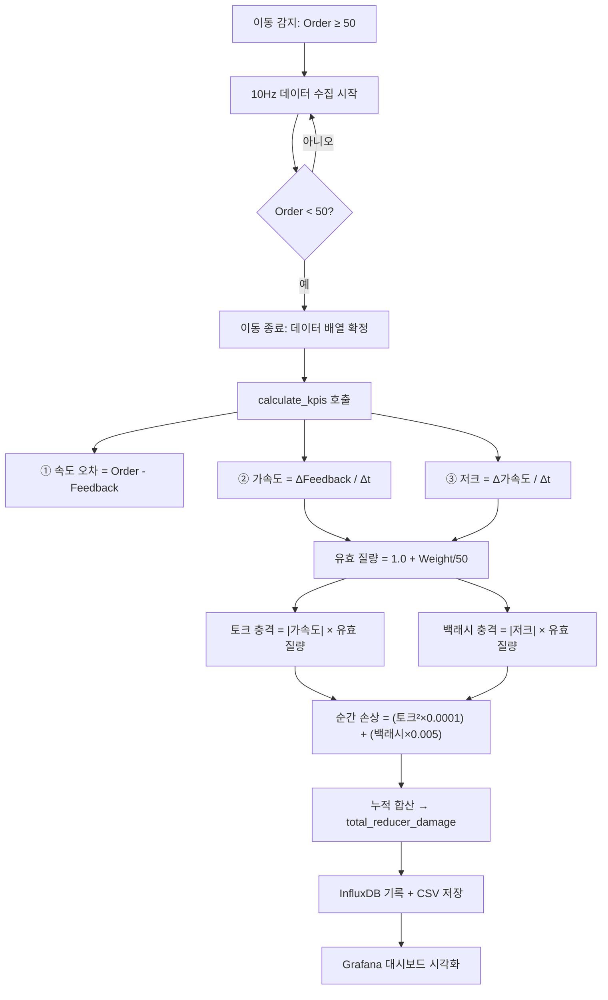

# 🔧 감속기 스트레스 계산 알고리즘 기술 문서

> **프로젝트**: CranePdM V1.0 — ARMGC 갠트리 감속기 예지정비 시스템  
> **핵심 파일**: `crane_edge_logger.py` → `calculate_kpis()` 함수  
> **최종 수정일**: 2026-03-05  

---

## 1. 개요

본 시스템은 ARMGC(자동화 레일 마운트 갠트리 크레인) 38대의 **갠트리 주행 감속기(Reducer)** 에 누적되는 기계적 피로도를 실시간으로 계산하고 시각화하는 예지정비(PdM) 프로그램입니다.

크레인이 레일 위를 이동할 때마다 PLC에서 **속도 명령값(Order)**, **속도 피드백값(Feedback)**, **하중(Weight)**, **위치(Position)** 데이터를 10Hz(0.1초 간격)로 수집하여, 이동 완료 시점에 아래의 알고리즘으로 KPI를 산출합니다.

---

## 2. 데이터 수집 (PLC 주소 매핑)

| 데이터 항목 | PLC 주소 | 데이터 타입 | 설명 |
|---|---|---|---|
| 속도 명령값 (Order) | `DB57.DBW8` | INT (2 byte) | PLC가 모터에 내리는 속도 명령 |
| 속도 피드백값 (Feedback) | `DB57.DBW10` | INT (2 byte) | 엔코더로 측정된 실제 모터 속도 |
| 트위스트락 잠금 (Twist Lock) | `DB58.DBX185.1` | BOOL (1 bit) | 컨테이너 적재 여부 (True = 적재) |
| 하중 (Weight) | `DB57.DBW48` | INT (2 byte) | 스프레더 위 화물 중량 |
| 갠트리 위치 (Position) | `DB57.DBW200` | INT (2 byte) | 레일 위 갠트리 현재 위치 |
| 케이블 릴 슬랙 폴트 | `DB59.DBX126.0` | BOOL (1 bit) | 케이블 처짐 결함 신호 |

---

## 3. 이벤트 감지 로직

### 3.1 이동 시작 조건
```
|속도 명령값(Order)| ≥ 50 (SPEED_THRESHOLD)
```
→ 이 조건이 충족되면 "이동 이벤트(Movement Event)"가 시작되고, 10Hz 고속 폴링 모드로 전환됩니다.

### 3.2 이동 종료 조건
```
|속도 명령값(Order)| < 50
```
→ 이 조건이 충족되면 이동이 완료된 것으로 간주하고, 수집된 전체 데이터 배열을 `calculate_kpis()` 함수에 전달합니다.

### 3.3 최소 이벤트 필터
```
이벤트 지속시간 > 1.0초
```
→ 1초 미만의 순간적인 떨림(Blip)은 무의미한 노이즈로 판단하여 폐기합니다.

---

## 4. 핵심 계산 알고리즘

`calculate_kpis()` 함수는 하나의 이동 이벤트 동안 수집된 데이터 배열을 순회하면서, 매 샘플(i)마다 4가지 핵심 지표를 계산합니다.

### 4.1 속도 오차 (Speed Error)

```
error[i] = order[i] - feedback[i]
```

- **max_error**: 이벤트 전체 구간에서의 최대 절대 오차
- **rms_error**: 이벤트 전체 구간의 제곱평균제곱근(RMS) 오차

```
rms_error = √( Σ(error²) / N )
```

> **의미**: 속도 명령과 실제 속도 사이의 괴리가 클수록 기계적 마찰이나 감속기 백래시(Backlash)가 크다는 것을 의미합니다.

---

### 4.2 운동학 계산 (Kinematics)

매 샘플 간격(dt)을 기반으로 **가속도(Acceleration)** 와 **저크(Jerk)** 를 수치 미분으로 산출합니다.

```
가속도[i] = (feedback[i] - feedback[i-1]) / dt
저크[i]   = (가속도[i] - 가속도[i-1]) / dt
```

| 물리량 | 수식 | 의미 |
|---|---|---|
| **가속도 (Acceleration)** | Δv / Δt | 속도의 변화율. 급가감속 시 감속기에 높은 토크가 전달됨 |
| **저크 (Jerk)** | Δa / Δt | 가속도의 변화율. 급격한 저크는 기어 치면에 충격 하중(Backlash Shock)을 유발 |

---

### 4.3 케이블 릴 스트레스 (Legacy — 참고용)

```
stress[i] = |error[i]| × 0.6 + |feedback[i] - feedback[i-1]| × 1.5
mean_stress = Σ(stress) / N
```

| 가중치 | 항목 | 근거 |
|---|---|---|
| **0.6** | 속도 오차 절대값 | 명령-실제 괴리가 케이블에 비틀림력 전달 |
| **1.5** | 속도 변화량 절대값 | 급격한 속도 변화가 케이블에 인장력 전달 |

> ⚠️ 이 지표는 현재 감속기 분석에는 직접 사용하지 않으며, 향후 케이블 릴 감속기 분석에 활용하기 위해 레거시로 유지 중입니다.

---

### 4.4 ⭐ 감속기 데미지 인덱스 (Reducer Damage Index) — 핵심 알고리즘

감속기의 **누적 피로 손상**을 정량화하는 핵심 공식입니다. 광산/기계공학에서 사용되는 **마이너 법칙(Miner's Rule)** 의 근사치를 적용합니다.

#### Step 1: 유효 질량 (Effective Mass)

```
effective_mass = 1.0 + (max(0, weight) / 50.0)
```

| 상태 | weight 값 | effective_mass | 설명 |
|---|---|---|---|
| 공차 (Empty) | 0 | 1.0 | 스프레더 자중만 적용 |
| 20톤 적재 | 20 | 1.4 | 자중 + 화물 40% 비중 |
| 50톤 만재 | 50 | 2.0 | 자중 + 화물 100% 비중 (최대) |

> **근거**: 감속기에 가해지는 토크는 이동시키는 총 질량에 비례합니다. 무거운 컨테이너를 싣고 급가감속할수록 기어 치면에는 훨씬 더 강렬한 힘이 작용합니다.

#### Step 2: 토크 충격량 (Torque Impact)

```
torque_impact = |가속도| × effective_mass
```

> **물리적 의미**: F = ma (뉴턴 제2법칙). 질량이 크고 가속도가 급격할수록 감속기 기어에 걸리는 토크가 폭발적으로 증가합니다.

#### Step 3: 백래시 충격량 (Backlash Shock)

```
backlash_shock = |저크| × effective_mass
```

> **물리적 의미**: 저크(가속도의 급변)는 기어 치면 사이의 미세 간극(Backlash)에서 발생하는 충격 하중을 대변합니다. 특히 정/역전 전환 시 발생하는 순간적인 저크가 감속기 수명을 결정적으로 단축시킵니다.

#### Step 4: 순간 손상량 (Instant Damage) — 마이너 법칙 근사

```
instant_damage = (torque_impact² × 0.0001) + (backlash_shock × 0.005)
```

| 항목 | 가중치 | 연산 | 근거 |
|---|---|---|---|
| **토크 충격** | 0.0001 | **제곱** 적용 | S-N 곡선 기반: 높은 토크는 지수적으로 피로 수명을 단축시킴 |
| **백래시 충격** | 0.005 | 선형 적용 | 저크에 의한 충격은 기어 표면 미세 균열을 선형적으로 누적시킴 |

> 💡 **핵심 설계 철학**: 토크 충격에 제곱(²)을 적용한 이유는, 기계공학의 S-N 피로 곡선에서 **응력이 2배 증가하면 수명은 4배 이상 감소**하는 비선형 관계를 반영하기 위함입니다. 이로 인해 "평소에 천천히 다니다가 가끔 한 번 폭주하는 크레인"이 "항상 중간 속도로 다니는 크레인"보다 훨씬 높은 데미지 지수를 기록하게 됩니다.

#### Step 5: 누적 피로 합산 (Total Reducer Damage)

```
total_reducer_damage = Σ(instant_damage[i])   (i = 1 ~ N)
```

> 매 이동 이벤트마다 이 값이 InfluxDB에 기록되며, 대시보드에서는 이 값의 **평균(Mean)** 또는 **누적합(Sum)** 을 기준으로 38대의 크레인을 위험도 랭킹으로 정렬합니다.

---

## 5. 전체 계산 흐름도



---

## 6. 출력 KPI 요약

| KPI 필드명 | 단위 | 설명 |
|---|---|---|
| `duration` | 초(s) | 이동 이벤트 지속 시간 |
| `peak_order` | - | 최대 속도 명령값 |
| `peak_feedback` | - | 최대 실제 속도 |
| `max_error` | - | 최대 속도 오차 |
| `rms_error` | - | RMS 속도 오차 |
| `mean_stress` | - | 평균 케이블 스트레스 (레거시) |
| `reducer_damage` | - | **감속기 누적 피로 손상 지수 (핵심)** |
| `avg_weight` | 톤(t) | 평균 화물 중량 |
| `is_loaded` | bool | 적재 여부 |
| `avg_pos` | - | 평균 갠트리 위치 |

---

## 7. 경고 임계값 (Threshold)

| 수준 | `reducer_damage` 값 | 색상 | 의미 |
|---|---|---|---|
| 🟢 정상 | < 20,000 | 초록 | 저위험: 감속기 상태 양호 |
| 🟠 주의 | 20,000 ~ 30,000 | 주황 | 중위험: 정밀 점검 권장 |
| 🔴 위험 | ≥ 30,000 | 빨강 | 고위험: 즉시 점검 필요 |

---

## 8. 대시보드 패널별 `reducer_damage` 적용 현황

현재 Grafana 대시보드에는 총 7개의 패널이 존재합니다. 이 중 **5개 패널**이 동일한 `reducer_damage` 필드(감속기 데미지 인덱스)를 조회하며, 나머지 2개는 별도의 데이터를 사용합니다.

### 8.1 `reducer_damage` 공식을 사용하는 패널 (5개)

| # | 패널 이름 | Flux 쿼리 핵심 | 집계 방식 | 시각화 |
|---|---|---|---|---|
| 1 | **Top 5 Risk Cranes** | `_field == "reducer_damage"` | `mean()` → 상위 5개 | 테이블 (게이지 셀) |
| 2 | **38 Fleet Status Matrix** | `_field == "reducer_damage"` | `mean()` → 38대 전체 | 신호등 (Stat) |
| 3 | **Fleet Outlier Detection** | `_field == "reducer_damage"` | `mean()` → 38대 전체 | 세로 막대그래프 |
| 4 | **Rail Health Mapping** | `_field == "reducer_damage"` + `avg_pos` | 원본값 (집계 없음) | XY 산점도 |
| 5 | **Reducer Damage Trend** | `_field == "reducer_damage"` | `aggregateWindow(mean)` | 시계열 꺾은선 |

> 💡 5개 패널 모두 **완전히 동일한 `reducer_damage` 값**을 기반으로 합니다. 차이점은 오직 **집계 방식(mean, 원본)과 시각화 형태(테이블, 그래프, 산점도)**뿐입니다.

### 8.2 `reducer_damage`를 사용하지 않는 패널 (2개)

| # | 패널 이름 | 사용 필드 | 설명 |
|---|---|---|---|
| 6 | **Daily Max Speed** | `peak_feedback` | 각 크레인의 당일 최고 속도 피드백값 (운영 참고용) |
| 7 | **Fault Hotspot Mapping** | `crane_faults` (position) | 케이블 릴 슬랙 결함 발생 위치 (결함 감시용) |

### 8.3 핵심 공식 요약 (한 줄 정리)

대시보드 5개 패널이 공통으로 표시하는 **`reducer_damage`** 값의 전체 공식을 한 줄로 축약하면 다음과 같습니다:

```
reducer_damage = Σ [ (|Δv/Δt| × M)² × 0.0001 + |Δ²v/Δt²| × M × 0.005 ]
```

여기서:
- `Δv/Δt` = 속도 피드백의 1차 미분 (가속도)
- `Δ²v/Δt²` = 속도 피드백의 2차 미분 (저크)
- `M` = 유효 질량 = `1.0 + (화물중량 / 50.0)`
- `Σ` = 이동 이벤트 전 구간에 걸친 누적 합산

---

*본 문서는 `crane_edge_logger.py` 소스코드를 기반으로 작성되었으며, 알고리즘 변경 시 함께 업데이트되어야 합니다.*
