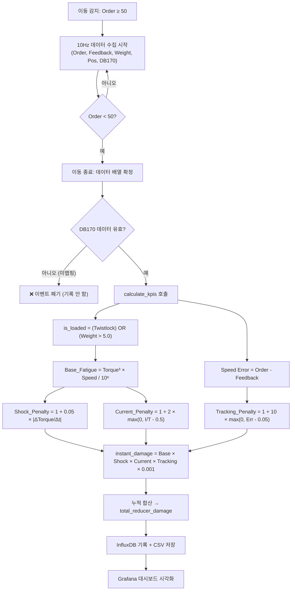

# 🔧 감속기 스트레스 계산 알고리즘 기술 문서 (V2.4)

> **프로젝트**: CranePdM V2.0 — ARMGC 케이블 릴(GCR) 감속기 예지정비 시스템  
> **핵심 파일**: `crane_edge_logger.py` → `calculate_kpis()` 함수  
> **알고리즘 버전**: V2.4 (속도 보정 및 지오펜싱 위치 기반 페널티 버전)  
> **최종 수정일**: 2026-04-22  

---

## 1. 개요

본 시스템은 ARMGC(자동화 레일 마운트 갠트리 크레인) 38대의 **Wampfler GCR (Generic Cable Reel) 감속기(Reducer)** 에 누적되는 기계적 피로도를 실시간으로 계산하고 시각화하는 예지정비(PdM) 프로그램입니다.

V2.0에서는 PLC를 통해 **케이블 릴 드라이브(Inverter)의 실측 물리량 (Torque, Speed, Current)** 을 직접 수집하여, **ISO 6336 기반 피로 모델**을 적용합니다.

> **V2.2 업데이트**: 케이블 릴 감속기는 컨테이너 중량물(Weight)과는 기계적으로 분리되어 있으므로, 하중 가중치를 제거하고 오직 **갠트리 주행 역학에 따른 케이블 장력(Tension) 및 충격**에 집중하도록 개선되었습니다.

> DB170 접점이 맵핑되지 않은 크레인(264호)은 이벤트가 기록되지 않습니다.

---

## 2. 데이터 수집 (PLC 주소 매핑)

### 2.1 갠트리 이동 데이터 (전 크레인 공통)

| 데이터 항목 | PLC 주소 | 데이터 타입 | 설명 |
|---|---|---|---|
| 속도 명령값 (Order) | `DB57.DBW8` | INT (2 byte) | PLC가 모터에 내리는 속도 명령 |
| 속도 피드백값 (Feedback) | `DB57.DBW10` | INT (2 byte) | 엔코더로 측정된 실제 모터 속도 |
| 트위스트락 잠금 (Twist Lock) | `DB58.DBX185.1` | BOOL (1 bit) | 컨테이너 적재 여부 (True = 적재) |
| 하중 (Weight) | `DB57.DBW48` | INT (2 byte) | 스프레더 위 화물 중량 |
| 갠트리 위치 (Position) | `DB57.DBW200` | INT (2 byte) | 레일 위 갠트리 현재 위치 |
| 케이블 릴 슬랙 폴트 | `DB59.DBX126.0` | BOOL (1 bit) | 케이블 처짐 결함 신호 |

### 2.2 케이블 릴 드라이브 데이터 (V2.0 핵심 — DB170)

| 데이터 항목 | PLC 주소 | 단위 | 설명 |
|---|---|---|---|
| 케이블 릴 속도 | `DB170.DBW0` | m/min | 케이블 릴 모터 실제 속도 |
| 케이블 릴 전류 | `DB170.DBW2` | Ampere (A) | 케이블 릴 인버터 소모 전류 |
| 케이블 릴 토크 | `DB170.DBW4` | % | 모터 정격 대비 현재 출력 토크 비율 |

---

## 3. 이벤트 감지 로직

### 3.1 이동 시작 조건
```
|속도 명령값(Order)| ≥ 50 (SPEED_THRESHOLD)
```
→ 이 조건이 충족되면 **이동 이벤트(Movement Event)** 가 시작되고, 10Hz 고속 폴링 모드로 전환됩니다.

### 3.2 이동 종료 조건
```
|속도 명령값(Order)| < 50
```
→ 이 조건이 충족되면 이동 완료로 간주하고, 수집된 전체 데이터 배열을 `calculate_kpis()` 함수에 전달합니다.

### 3.3 최소 이벤트 필터 (V2.1 수정)
```
이벤트 지속시간 > 3.0초
```
→ 3초 미만의 짧은 이동은 유의미한 스트레스 축적이 없으므로 노이즈로 판단하여 폐기합니다. (V2.0: 1초)

### 3.4 DB170 데이터 필수 조건
```
db170_list의 모든 샘플이 유효한 경우에만 이벤트 기록
```
→ DB170 데이터 미수신 시(접점 미맵핑 크레인) 이벤트는 기록되지 않습니다.

---

## 4. ⭐ 핵심 계산 알고리즘 (V2.0 Physical Model)

`calculate_kpis()` 함수는 하나의 이동 이벤트 동안 수집된 데이터를 순회하면서, 매 샘플(i)마다 아래 공식으로 순간 손상량을 계산 및 누적합니다.

### 전체 공식 (한 줄 요약)
```
reducer_damage = Σ [ Base_Fatigue × Shock_Penalty × Current_Penalty × Tracking_Penalty × Geo_Penalty ]
```

---

### Step 1: 기저 피로도 — Base Fatigue (Miner's Rule / ISO 6336)

```
Base_Fatigue = (|Torque(%)|³ × |Speed(m/min)|) / 1,000,000
```

| 항목 | 근거 |
|---|---|
| **Torque³** | ISO 6336 기어 피로 모델: 응력이 2배 → 수명 소모 8배 (3승 법칙) |
| **Speed** | 누적 회전 횟수에 비례하여 피로 누적 |
| **V2.2 수정** | 케이블 릴 하중은 컨테이너 무게가 아닌 케이블 자체의 장력에 의존하므로 Weight Factor(하중 보정)를 제거함 |

> **중량 클램핑(V2.1)**: 센서 노이즈 제거를 위해 0~60톤 범위로 제한 처리 (`avg_weight = max(0, min(wt, 60))`)

---

### Step 2: 동역학적 속도 보정 충격 페널티 — Speed-Normalized Shock Penalty (V2.4)

```
Raw_Shock = 1.0 + 0.06 × |ΔTorque / Δt|
Speed_Factor = max(0.3, |Speed| / 10000.0)
Shock_Penalty (합산용) = min(10.0, 1.0 + (Raw_Shock - 1.0) / Speed_Factor)
Peak_Shock (기록용) = 무제한 (Raw_Shock 그대로 표출)
```

> **V2.4 변경**: 저속 주행 시 발생하는 토크 튐(Shock)은 고속 주행 시보다 훨씬 치명적(기어 유격 심화)이므로, 속도가 느릴수록(Speed_Factor가 작을수록) 충격 페널티를 최대 3배까지 증폭시킵니다. 최고 순간 충격량 지표인 `Peak_Shock`은 V2.3과 동일하게 순수 물리 타격량을 기록합니다.

---

### Step 3A: 속도 보정 기계적 저항 페널티 — Speed-Normalized Current Penalty (V2.4)

```
Current_Ratio = |Current(A)| / (|Torque(%)| + 0.1)
Raw_Curr_Penalty = 1.0 + 5.0 × max(0, Current_Ratio - 0.2)
Speed_Factor = max(0.5, |Speed| / 10000.0)
Current_Penalty = min(10.0, 1.0 + (Raw_Curr_Penalty - 1.0) / Speed_Factor)
```

> **V2.4 변경**: 토크 대비 전류가 높을 뿐만 아니라, 속도가 느린데도 불구하고 전류를 많이 소모한다면 강력한 기계적 마찰(쇳가루 등)의 증거입니다. 따라서 속도가 느릴수록 전류 이상 페널티를 최대 2배까지 증폭시킵니다.

---

### Step 3B: 속도 추종 이상 페널티 — Tracking Error (V2.1 튜닝)

```
If |Order| > 500:
    Tracking_Error_Ratio = |Order - Feedback| / (|Order| + 50.0)
    Tracking_Penalty = min(10.0, 1.0 + 5.0 × max(0, Tracking_Error_Ratio - 0.05))
Else:
    Tracking_Penalty = 1.0
```

> **V2.1 변경점**: 
> 1. 저속 구간 노이즈 방지 게이트 상향 (**100 → 500**)
> 2. 페널티 증폭 계수 하향 (**10.0 → 5.0**) 하여 타 페널티(Shock, Current)와의 밸런스 유지.

---

### Step 3C: 지오펜싱 위치 페널티 — Geo-fenced Track Penalty (V2.4)

```
If 2,400m <= Position <= 2,700m:
    Geo_Penalty = 2.0
Else:
    Geo_Penalty = 1.0
```

> **V2.4 도입**: 232호기 파손 사건 분석을 통해 항만 내 모든 크레인이 공통적으로 2,400m~2,700m 구간에서 11G 이상의 거대한 물리적 타격을 받는 것으로 증명되었습니다. 따라서 이 구간(지뢰밭)에 진입하면 무조건 2배의 페널티를 곱하여 피로도 누적을 2배 가속합니다.

---

### Step 4: 누적 합산 및 최종 제한(Capping)

```
Total_Penalty = min(20.0, Shock_Penalty × Current_Penalty × Tracking_Penalty × Geo_Penalty)
Instant_Damage = Base_Fatigue × Total_Penalty × 0.001
Total_Reducer_Damage = Σ(Instant_Damage[i])
```

> 개별 페널티가 아무리 높더라도 총합 페널티를 **20배**로 제한하여 단일 이벤트가 전체 통계를 왜곡하는 것을 방지합니다.

---

## 5. 전체 계산 흐름도



---

## 6. 출력 KPI 요약

| KPI 필드명 | 단위 | 설명 |
|---|---|---|
| `algo_version` | - | 항상 `"2.3"` |
| `duration` | 초(s) | 이동 이벤트 지속 시간 |
| `peak_order` | - | 최대 속도 명령값 |
| `peak_feedback` | - | 최대 실제 속도 |
| `max_error` | - | 최대 속도 오차 |
| `rms_error` | - | RMS 속도 오차 |
| `reducer_damage` | - | **감속기 V2.0 피로 손상 지수 (핵심)** |
| `avg_weight` | 톤(t) | 평균 화물 중량 |
| `is_loaded` | bool | 적재 여부 |
| `avg_pos` | - | 평균 갠트리 위치 |
| `peak_shock_pos` | - | **최대 충격(Peak Shock) 발생 시점의 정확한 레일 위치** |
| `peak_shock` | G | 최대 순간 충격량 |
| `shock_penalty` | - | 평균 충격 페널티 |
| `curr_penalty` | - | 평균 전류/마찰 페널티 |
| `track_penalty` | - | 평균 갠트리 속도 오차 페널티 |

---

## 7. 경고 임계값 (V2.0 기준 — 데이터 축적 후 조정 예정)

> 현재 수집 데이터 기준 (286건, ~30분): 평균 ≈ 300, 중앙값 ≈ 14

| 수준 | `reducer_damage` 값 | 색상 | 의미 |
|---|---|---|---|
| 🟢 정상 | < 200 | 초록 | 저위험: 감속기 상태 양호 |
| 🟠 주의 | 200 ~ 1,000 | 주황 | 중위험: 정밀 점검 권장 |
| 🔴 위험 | ≥ 1,000 | 빨강 | 고위험: 즉시 점검 필요 |

> ⚠️ **임계값은 1~2주 데이터 축적 후 장비별 베이스라인을 산출하여 재조정** 해야 합니다.

---

## 8. 대시보드 패널별 `reducer_damage` 적용 현황

현재 Grafana 대시보드에는 총 7개의 패널이 존재합니다.

### 8.1 `reducer_damage` 공식을 사용하는 패널 (5개)

| # | 패널 이름 | Flux 쿼리 핵심 | 집계 방식 | 시각화 |
|---|---|---|---|---|
| 1 | **Top 5 Risk Cranes** | `_field == "reducer_damage"` | `mean()` → 상위 5개 | 테이블 (게이지 셀) |
| 2 | **38 Fleet Status Matrix** | `_field == "reducer_damage"` | `mean()` → 38대 전체 | 신호등 (Stat) |
| 3 | **Fleet Outlier Detection** | `_field == "reducer_damage"` | `mean()` → 38대 전체 | 세로 막대그래프 |
| 4 | **Rail Health Mapping** | `_field == "reducer_damage"` + `avg_pos` | 원본값 (집계 없음) | XY 산점도 |
| 5 | **Reducer Damage Trend** | `_field == "reducer_damage"` | `aggregateWindow(mean)` | 시계열 꺾은선 |

### 8.2 `reducer_damage`를 사용하지 않는 패널 (2개)

| # | 패널 이름 | 사용 필드 | 설명 |
|---|---|---|---|
| 6 | **Daily Max Speed** | `peak_feedback` | 각 크레인의 당일 최고 속도 피드백값 |
| 7 | **Fault Hotspot Mapping** | `crane_faults` (position) | 케이블 릴 슬랙 결함 발생 위치 |

---

*본 문서는 `crane_edge_logger.py` V2.0 소스코드를 기반으로 작성되었습니다.*
